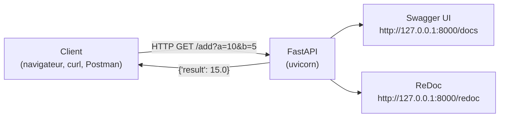
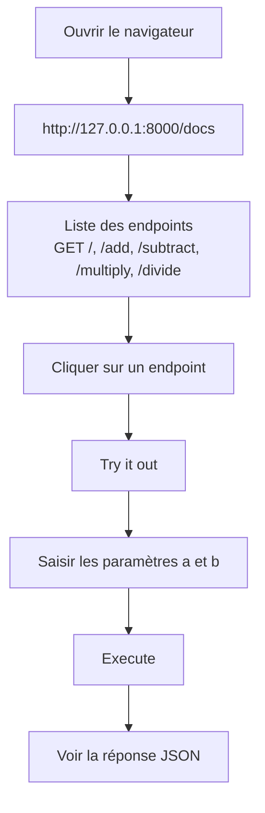

<a id="top"></a>

# FastAPI — Calculatrice API avec Swagger UI

## Table of Contents

| #  | Section                                                                              |
| -- | ------------------------------------------------------------------------------------ |
| 1  | [Introduction à FastAPI et Swagger UI](#section-1)                                   |
| 2  | [Environnement virtuel Python](#section-2)                                            |
| 2a | &nbsp;&nbsp;&nbsp;↳ [Alternative Python 3.9](#section-2)                             |
| 3  | [Installation de FastAPI et Uvicorn](#section-3)                                      |
| 4  | [Création du fichier `main.py`](#section-4)                                           |
| 4a | &nbsp;&nbsp;&nbsp;↳ [Endpoints : add, subtract, multiply, divide](#section-4)        |
| 5  | [Lancement de l'application](#section-5)                                              |
| 6  | [Interface Swagger UI](#section-6)                                                    |
| 7  | [Test des endpoints dans Swagger](#section-7)                                         |
| 8  | [Annexe — URLs de test rapide](#section-8)                                            |
| 9  | [Conclusion](#section-9)                                                              |

---

<a id="section-1"></a>

<details>
<summary>1 - Introduction à FastAPI et Swagger UI</summary>

<br/>

**FastAPI** est un framework Python moderne pour construire des APIs web rapidement, avec une validation automatique des données et une documentation interactive générée automatiquement.

**Swagger UI** est cette documentation interactive disponible à `/docs` : elle permet de tester tous les endpoints directement dans le navigateur, sans outil externe.



Dans ce tutoriel, on crée une **calculatrice API** avec les 4 opérations de base exposées comme endpoints HTTP.

</details>

<p align="right"><a href="#top">↑ Back to top</a></p>

---

<a id="section-2"></a>

<details>
<summary>2 - Environnement virtuel Python</summary>

<br/>

Il est recommandé d'isoler chaque projet Python dans son propre environnement virtuel pour éviter les conflits de dépendances.

```bash
cd mon_projet
python -m venv monfastapi
monfastapi\Scripts\activate
python --version
pip install fastapi uvicorn
deactivate
```

Ces commandes :

1. Naviguent vers le dossier du projet.
2. Créent l'environnement virtuel `monfastapi`.
3. Activent l'environnement.
4. Installent FastAPI et Uvicorn.
5. Désactivent l'environnement.

Pour réactiver l'environnement plus tard :

```bash
monfastapi\Scripts\activate
```

---

### Alternative Python 3.9

Si plusieurs versions de Python sont installées sur la machine :

```bash
cd mon_projet_2
python3.9 -m venv monfastapi
monfastapi\Scripts\activate
python --version
pip install fastapi uvicorn
deactivate
```

</details>

<p align="right"><a href="#top">↑ Back to top</a></p>

---

<a id="section-3"></a>

<details>
<summary>3 - Installation de FastAPI et Uvicorn</summary>

<br/>

**FastAPI** est le framework web. **Uvicorn** est le serveur ASGI qui l'exécute.

```bash
pip install fastapi
pip install "uvicorn[standard]"
```

> La variante `uvicorn[standard]` installe les dépendances optionnelles (rechargement automatique, support WebSocket, etc.).

</details>

<p align="right"><a href="#top">↑ Back to top</a></p>

---

<a id="section-4"></a>

<details>
<summary>4 - Création du fichier main.py</summary>

<br/>

Créer un fichier `main.py` dans le dossier du projet :

```python
from fastapi import FastAPI, HTTPException

app = FastAPI()

@app.get("/")
def read_root():
    return {"message": "Welcome to the Calculator API"}

@app.get("/add")
def add(a: float, b: float):
    return {"result": a + b}

@app.get("/subtract")
def subtract(a: float, b: float):
    return {"result": a - b}

@app.get("/multiply")
def multiply(a: float, b: float):
    return {"result": a * b}

@app.get("/divide")
def divide(a: float, b: float):
    if b == 0:
        raise HTTPException(status_code=400, detail="Division by zero is not allowed")
    return {"result": a / b}
```

---

### Explication des endpoints

| Endpoint      | Méthode | Paramètres     | Description                                  |
| ------------- | ------- | -------------- | -------------------------------------------- |
| `/`           | GET     | —              | Message d'accueil                             |
| `/add`        | GET     | `a`, `b` float | Addition de deux nombres                      |
| `/subtract`   | GET     | `a`, `b` float | Soustraction                                  |
| `/multiply`   | GET     | `a`, `b` float | Multiplication                                |
| `/divide`     | GET     | `a`, `b` float | Division — lève une erreur 400 si `b == 0`   |

</details>

<p align="right"><a href="#top">↑ Back to top</a></p>

---

<a id="section-5"></a>

<details>
<summary>5 - Lancement de l'application</summary>

<br/>

```bash
uvicorn main:app --reload
```

L'option `--reload` redémarre automatiquement le serveur à chaque modification du code (utile en développement).

L'application est accessible à :

- **API** : [http://127.0.0.1:8000](http://127.0.0.1:8000)
- **Swagger UI** : [http://127.0.0.1:8000/docs](http://127.0.0.1:8000/docs)
- **ReDoc** : [http://127.0.0.1:8000/redoc](http://127.0.0.1:8000/redoc)

</details>

<p align="right"><a href="#top">↑ Back to top</a></p>

---

<a id="section-6"></a>

<details>
<summary>6 - Interface Swagger UI</summary>

<br/>

Swagger UI est généré automatiquement par FastAPI à partir des types Python déclarés dans le code. Il est accessible à `/docs`.



</details>

<p align="right"><a href="#top">↑ Back to top</a></p>

---

<a id="section-7"></a>

<details>
<summary>7 - Test des endpoints dans Swagger</summary>

<br/>

Pour tester chaque endpoint :

1. Cliquer sur l'endpoint (ex. `/add`) dans Swagger UI.
2. Cliquer sur **"Try it out"**.
3. Entrer les valeurs des paramètres `a` et `b`.
4. Cliquer sur **"Execute"** pour envoyer la requête.
5. La réponse JSON s'affiche directement dans l'interface.

---

### Exemples de réponses

| Endpoint    | Requête                        | Réponse              |
| ----------- | ------------------------------ | -------------------- |
| `/`         | `GET /`                        | `{"message": "..."}` |
| `/add`      | `GET /add?a=10&b=5`            | `{"result": 15.0}`   |
| `/subtract` | `GET /subtract?a=10&b=5`       | `{"result": 5.0}`    |
| `/multiply` | `GET /multiply?a=10&b=5`       | `{"result": 50.0}`   |
| `/divide`   | `GET /divide?a=10&b=5`         | `{"result": 2.0}`    |
| `/divide`   | `GET /divide?a=10&b=0`         | HTTP 400 error       |

</details>

<p align="right"><a href="#top">↑ Back to top</a></p>

---

<a id="section-8"></a>

<details>
<summary>8 - Annexe — URLs de test rapide</summary>

<br/>

Ces URLs peuvent être copiées directement dans le navigateur ou dans un outil comme Postman :

```text
http://127.0.0.1:8000/add?a=2&b=5
http://127.0.0.1:8000/subtract?a=2&b=5
http://127.0.0.1:8000/multiply?a=2&b=5
http://127.0.0.1:8000/divide?a=2&b=5
```

</details>

<p align="right"><a href="#top">↑ Back to top</a></p>

---

<a id="section-9"></a>

<details>
<summary>9 - Conclusion</summary>

<br/>

Ce tutoriel a couvert la création d'une API calculatrice complète avec FastAPI :

- Création et activation d'un environnement virtuel Python
- Installation de FastAPI et Uvicorn
- Définition de 5 endpoints GET avec validation de types automatique
- Utilisation de Swagger UI pour documenter et tester l'API

Cette API peut facilement être étendue pour inclure d'autres opérations ou être connectée à un frontend Streamlit.

Pour aller plus loin, consulter la [documentation officielle FastAPI](https://fastapi.tiangolo.com/).

</details>

<p align="right"><a href="#top">↑ Back to top</a></p>
