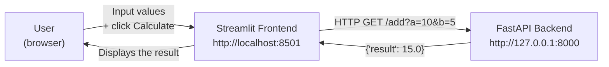
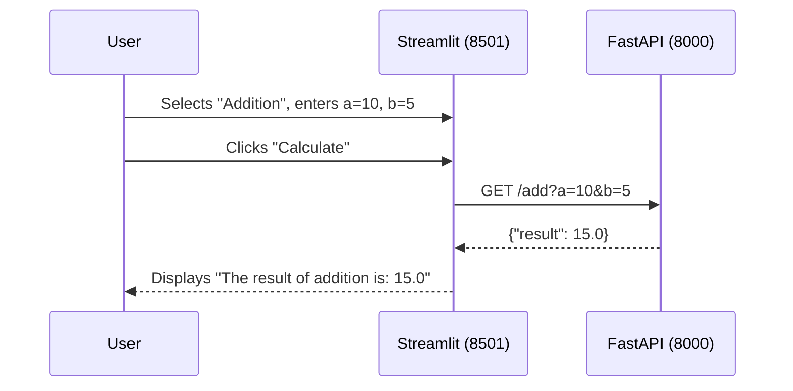

<a id="top"></a>

# FastAPI — Calculator: Streamlit Frontend and FastAPI Backend

## Table of Contents

| #  | Section                                                                              |
| -- | ------------------------------------------------------------------------------------ |
| 1  | [Project Description](#section-1)                                                    |
| 2  | [Frontend / Backend Architecture](#section-2)                                        |
| 3  | [Prerequisites](#section-3)                                                          |
| 4  | [Installation](#section-4)                                                           |
| 4a | &nbsp;&nbsp;&nbsp;↳ [Clone the repository and create the virtual environment](#section-4) |
| 4b | &nbsp;&nbsp;&nbsp;↳ [Install dependencies](#section-4)                              |
| 5  | [FastAPI Backend — `backend.py`](#section-5)                                         |
| 6  | [Streamlit Frontend — `frontend.py`](#section-6)                                     |
| 7  | [Starting and using the application](#section-7)                                     |
| 8  | [Project structure](#section-8)                                                      |
| 9  | [Important notes](#section-9)                                                        |
| 10 | [Commands summary](#section-10)                                                      |

---

<a id="section-1"></a>

<details>
<summary>1 - Project Description</summary>

<br/>

This project creates a simple web calculator using:

- **Streamlit** for the frontend — visual interface in the browser
- **FastAPI** for the backend — REST API that performs the calculations

The user chooses an operation (addition, subtraction, multiplication, division) and enters two numbers in the Streamlit interface. The frontend sends the request to the FastAPI backend which returns the result.

</details>

<p align="right"><a href="#top">↑ Back to top</a></p>

---

<a id="section-2"></a>

<details>
<summary>2 - Frontend / Backend Architecture</summary>

<br/>



Both services run in parallel in two separate terminals. Streamlit acts as an HTTP client that queries FastAPI.

</details>

<p align="right"><a href="#top">↑ Back to top</a></p>

---

<a id="section-3"></a>

<details>
<summary>3 - Prerequisites</summary>

<br/>

- Python 3.7 or newer
- `pip` (Python package manager)
- Two available terminals (one for backend, one for frontend)

</details>

<p align="right"><a href="#top">↑ Back to top</a></p>

---

<a id="section-4"></a>

<details>
<summary>4 - Installation</summary>

<br/>

### Clone the repository and create the virtual environment

```bash
git clone https://github.com/hrhouma/fastapi-calculator.git
cd fastapi-calculator

python -m venv myenv

# Windows
myenv\Scripts\activate

# macOS / Linux
source myenv/bin/activate
```

### Install dependencies

```bash
pip install streamlit requests fastapi uvicorn
```

</details>

<p align="right"><a href="#top">↑ Back to top</a></p>

---

<a id="section-5"></a>

<details>
<summary>5 - FastAPI Backend — backend.py</summary>

<br/>

Create a `backend.py` file with the 4 calculation endpoints:

```python
from fastapi import FastAPI, HTTPException

app = FastAPI()

@app.get("/add")
def add(a: float, b: float):
    return {"result": a + b}

@app.get("/subtract")
def subtract(a: float, b: float):
    return {"result": a - b}

@app.get("/multiply")
def multiply(a: float, b: float):
    return {"result": a * b}

@app.get("/divide")
def divide(a: float, b: float):
    if b == 0:
        raise HTTPException(status_code=400, detail="Division by zero")
    return {"result": a / b}
```

Start the FastAPI server (in **terminal 1**):

```bash
uvicorn backend:app --reload
```

> The backend listens on `http://127.0.0.1:8000`

</details>

<p align="right"><a href="#top">↑ Back to top</a></p>

---

<a id="section-6"></a>

<details>
<summary>6 - Streamlit Frontend — frontend.py</summary>

<br/>

Create a `frontend.py` file:

```python
import streamlit as st
import requests

API_URL = "http://127.0.0.1:8000"

st.title("Calculator with Streamlit and FastAPI")

operation = st.selectbox("Choose an operation", ["Addition", "Subtraction", "Multiplication", "Division"])
a = st.number_input("Enter the first number", format="%f")
b = st.number_input("Enter the second number", format="%f")

if st.button("Calculate"):
    if operation == "Addition":
        response = requests.get(f"{API_URL}/add", params={"a": a, "b": b})
    elif operation == "Subtraction":
        response = requests.get(f"{API_URL}/subtract", params={"a": a, "b": b})
    elif operation == "Multiplication":
        response = requests.get(f"{API_URL}/multiply", params={"a": a, "b": b})
    elif operation == "Division":
        response = requests.get(f"{API_URL}/divide", params={"a": a, "b": b})

    if response.status_code == 200:
        result = response.json().get("result")
        st.success(f"The result of {operation.lower()} is: {result}")
    else:
        st.error(f"Error: {response.json().get('detail')}")
```

Start the Streamlit interface (in **terminal 2**):

```bash
streamlit run frontend.py
```

> The frontend is accessible at `http://localhost:8501`

</details>

<p align="right"><a href="#top">↑ Back to top</a></p>

---

<a id="section-7"></a>

<details>
<summary>7 - Starting and using the application</summary>

<br/>



**Steps:**

1. Open a browser at the address shown by Streamlit (default `http://localhost:8501`).
2. Select an operation from the dropdown list.
3. Enter the two numbers.
4. Click **"Calculate"** to see the result.

</details>

<p align="right"><a href="#top">↑ Back to top</a></p>

---

<a id="section-8"></a>

<details>
<summary>8 - Project structure</summary>

<br/>

```text
fastapi-calculator/
├── backend.py
├── frontend.py
├── README.md
└── myenv/
```

</details>

<p align="right"><a href="#top">↑ Back to top</a></p>

---

<a id="section-9"></a>

<details>
<summary>9 - Important notes</summary>

<br/>

- The FastAPI backend **must be started before** the Streamlit frontend.
- If connection issues occur, verify that the API URL in `frontend.py` matches the address where FastAPI is running (`http://127.0.0.1:8000`).
- Both services must run simultaneously in two separate terminals.

</details>

<p align="right"><a href="#top">↑ Back to top</a></p>

---

<a id="section-10"></a>

<details>
<summary>10 - Commands summary</summary>

<br/>

```bash
# Clone the repository
git clone https://github.com/hrhouma/fastapi-calculator.git
cd fastapi-calculator

# Create and activate the virtual environment
python -m venv myenv
# Windows
myenv\Scripts\activate
# macOS / Linux
source myenv/bin/activate

# Install dependencies
pip install streamlit requests fastapi uvicorn

# Terminal 1 — Start the FastAPI backend
uvicorn backend:app --reload

# Terminal 2 — Start the Streamlit frontend
streamlit run frontend.py
```

</details>

<p align="right"><a href="#top">↑ Back to top</a></p>
