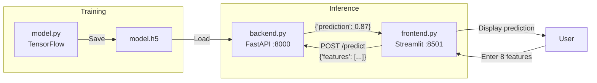
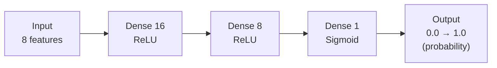

<a id="top"></a>

# FastAPI — TensorFlow + Streamlit: Classification Model

## Table of Contents

| #  | Section                                                                               |
| -- | ------------------------------------------------------------------------------------- |
| 1  | [Project Description](#section-1)                                                     |
| 2  | [Global Architecture](#section-2)                                                     |
| 3  | [Project Structure](#section-3)                                                       |
| 4  | [File `model.py` — Model Training](#section-4)                                        |
| 4a | &nbsp;&nbsp;&nbsp;↳ [Data generation and network architecture](#section-4)           |
| 5  | [File `backend.py` — Prediction API](#section-5)                                      |
| 6  | [File `frontend.py` — Streamlit Interface](#section-6)                                |
| 7  | [File `requirements.txt`](#section-7)                                                 |
| 8  | [Installation and execution steps](#section-8)                                        |
| 8a | &nbsp;&nbsp;&nbsp;↳ [Clone, virtual environment, dependencies](#section-8)           |
| 8b | &nbsp;&nbsp;&nbsp;↳ [Train the model](#section-8)                                    |
| 8c | &nbsp;&nbsp;&nbsp;↳ [Start the backend and frontend](#section-8)                     |
| 9  | [Commands summary](#section-9)                                                        |

---

<a id="section-1"></a>

<details>
<summary>1 - Project Description</summary>

<br/>

This project is an end-to-end machine learning application using three complementary technologies:

- **TensorFlow** — trains a binary classification model and saves it to `model.h5`
- **FastAPI** — loads the trained model and exposes a `/predict` endpoint via a REST API
- **Streamlit** — provides a user interface to enter data and display predictions

The user enters 8 numeric values (features) in the Streamlit interface. The frontend sends them to the FastAPI backend which uses the TensorFlow model to return a prediction.

</details>

<p align="right"><a href="#top">↑ Back to top</a></p>

---

<a id="section-2"></a>

<details>
<summary>2 - Global Architecture</summary>

<br/>



**Required execution order:**

1. Run `model.py` to generate `model.h5`
2. Start `backend.py` with uvicorn
3. Start `frontend.py` with streamlit

</details>

<p align="right"><a href="#top">↑ Back to top</a></p>

---

<a id="section-3"></a>

<details>
<summary>3 - Project Structure</summary>

<br/>

```text
fastapi-calculator-tensorflow-1/
├── model.py          ← model training and saving
├── backend.py        ← FastAPI API for predictions
├── frontend.py       ← Streamlit user interface
├── model.h5          ← trained model (generated by model.py)
├── requirements.txt
└── README.md
```

</details>

<p align="right"><a href="#top">↑ Back to top</a></p>

---

<a id="section-4"></a>

<details>
<summary>4 - File model.py — Model Training</summary>

<br/>

This script generates synthetic training data, builds a simple neural network and saves the trained model.

```python
import tensorflow as tf
from tensorflow.keras.models import Sequential
from tensorflow.keras.layers import Dense
import numpy as np

def generate_data():
    X = np.random.rand(1000, 8)  # 1000 samples, 8 features
    y = (X.sum(axis=1) > 4).astype(int)  # class 1 if sum > 4, else 0
    return X, y

def train_model():
    X, y = generate_data()
    model = Sequential([
        Dense(16, activation='relu', input_shape=(8,)),
        Dense(8, activation='relu'),
        Dense(1, activation='sigmoid')
    ])
    model.compile(optimizer='adam', loss='binary_crossentropy', metrics=['accuracy'])
    model.fit(X, y, epochs=10)
    model.save('model.h5')

if __name__ == "__main__":
    train_model()
```

---

### Neural network architecture



- **ReLU** in hidden layers to learn non-linear relationships
- **Sigmoid** in output to obtain a probability between 0 and 1 (binary classification)

</details>

<p align="right"><a href="#top">↑ Back to top</a></p>

---

<a id="section-5"></a>

<details>
<summary>5 - File backend.py — Prediction API</summary>

<br/>

The backend loads the saved model and exposes a POST `/predict` endpoint that accepts a list of 8 features and returns the prediction.

```python
from fastapi import FastAPI
from pydantic import BaseModel
import tensorflow as tf
import numpy as np

model = tf.keras.models.load_model('model.h5')

class PredictionInput(BaseModel):
    features: list

app = FastAPI()

@app.post("/predict")
def predict(input: PredictionInput):
    features = np.array(input.features).reshape(1, -1)
    prediction = model.predict(features)
    return {"prediction": float(prediction[0, 0])}
```

**Expected request body:**

```json
{
  "features": [0.5, 0.3, 0.8, 0.1, 0.9, 0.4, 0.6, 0.7]
}
```

**Response:**

```json
{
  "prediction": 0.87
}
```

Start the server (in **terminal 1**):

```bash
uvicorn backend:app --reload
```

</details>

<p align="right"><a href="#top">↑ Back to top</a></p>

---

<a id="section-6"></a>

<details>
<summary>6 - File frontend.py — Streamlit Interface</summary>

<br/>

```python
import streamlit as st
import requests

API_URL = "http://127.0.0.1:8000"

st.title("Prediction with TensorFlow, FastAPI and Streamlit")

features = [st.number_input(f"Feature {i+1}", format="%f") for i in range(8)]

if st.button("Predict"):
    response = requests.post(f"{API_URL}/predict", json={"features": features})
    if response.status_code == 200:
        prediction = response.json().get("prediction")
        st.success(f"The prediction is: {prediction}")
    else:
        st.error("Prediction error")
```

Start the interface (in **terminal 2**):

```bash
streamlit run frontend.py
```

> The interface is accessible at `http://localhost:8501`

</details>

<p align="right"><a href="#top">↑ Back to top</a></p>

---

<a id="section-7"></a>

<details>
<summary>7 - File requirements.txt</summary>

<br/>

```text
tensorflow
fastapi
uvicorn
pydantic
streamlit
requests
```

Install all dependencies with a single command:

```bash
pip install -r requirements.txt
```

</details>

<p align="right"><a href="#top">↑ Back to top</a></p>

---

<a id="section-8"></a>

<details>
<summary>8 - Installation and execution steps</summary>

<br/>

### Clone, virtual environment, dependencies

```bash
git clone https://github.com/hrhouma/fastapi-calculator-tensorflow-1.git
cd fastapi-calculator-tensorflow-1

python -m venv myenv

# Windows
myenv\Scripts\activate
# macOS / Linux
source myenv/bin/activate

pip install -r requirements.txt
```

### Train the model

```bash
python model.py
```

> This step generates the `model.h5` file in the project folder. **Run only once** (or re-run if you want to retrain).

### Start the backend and frontend

```bash
# Terminal 1
uvicorn backend:app --reload

# Terminal 2
streamlit run frontend.py
```

</details>

<p align="right"><a href="#top">↑ Back to top</a></p>

---

<a id="section-9"></a>

<details>
<summary>9 - Commands summary</summary>

<br/>

```bash
# Clone the repository
git clone https://github.com/hrhouma/fastapi-calculator-tensorflow-1.git
cd fastapi-calculator-tensorflow-1

# Create and activate the virtual environment
python -m venv myenv
# Windows
myenv\Scripts\activate
# macOS / Linux
source myenv/bin/activate

# Install dependencies
pip install -r requirements.txt

# Train and save the model
python model.py

# Terminal 1 — Start the FastAPI backend
uvicorn backend:app --reload

# Terminal 2 — Start the Streamlit frontend
streamlit run frontend.py
```

</details>

<p align="right"><a href="#top">↑ Back to top</a></p>
