# Simple Project Using TensorFlow, FastAPI, and Streamlit

<details>

<summary>Project Summary</summary>

<br/>
This project demonstrates a simple end-to-end machine learning application using:

- **TensorFlow** to train a binary classification model
- **FastAPI** to expose the trained model through a REST API
- **Streamlit** to build a lightweight frontend interface

The user enters 8 numeric features in the Streamlit interface, the frontend sends them to the FastAPI backend, and the backend returns a prediction generated by the TensorFlow model.

</details>

---

<details>
<summary>1 - Project Goal</summary>
<br/>

The goal of this project is to show how a machine learning model can be:

1. **trained locally** with TensorFlow,
2. **saved to disk**,
3. **loaded inside a backend API**,
4. **used by a frontend application** for real-time prediction.

This is a small but complete example of an AI-powered application with a clear separation between:

- **model training**
- **backend inference**
- **frontend interaction**

---

### What does "end-to-end" mean?

The expression **end-to-end** means that the project covers the complete journey of a machine learning model, from the moment it is trained on raw data to the moment a user receives a prediction through a web interface. Most projects in machine learning courses focus only on the training part, but in real-world applications, training is just one step among many. This project demonstrates all the steps together so that the full workflow becomes visible.

The following diagram shows the three phases covered in this project:

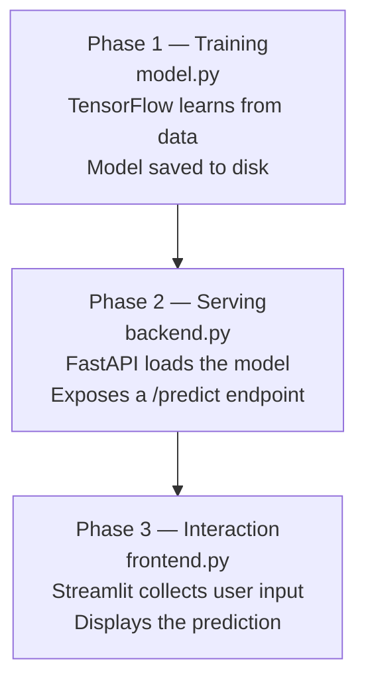

---

### Why separate training from serving?

Training a model is a computationally expensive process that can take minutes, hours, or even days depending on the dataset size and the model complexity. It would be inefficient and impractical to retrain the model every time a user wants a prediction.

The solution is to train the model once, save it to disk, and then load the saved model each time the server starts. This way, the backend only needs to load the file once at startup, and it can then serve thousands of predictions quickly without retraining.

This is the standard approach used in production AI systems. The model is trained offline, versioned, stored, and deployed separately from the application logic.

---

### Why use three separate technologies?

Each technology used in this project has a clear role:

| Technology | Role | Strength |
|---|---|---|
| TensorFlow | Train and run the neural network | Numerical computation, GPU support |
| FastAPI | Expose the model through an HTTP API | Fast, modern, auto-documentation |
| Streamlit | Build the user interface | Simple Python UI without JavaScript |

Using these three tools together creates a clean and realistic architecture that mirrors how production AI applications are actually built. The model does not know about the interface, and the interface does not know about the model internals. They communicate only through the API.

---

### What problem does this project solve?

Imagine you have trained a machine learning model that can predict whether a patient is at risk, whether a transaction is fraudulent, or whether an email is spam. The model exists as a Python object in memory during training, but after training, it needs to be accessible to other systems, other languages, other devices, and other users.

This is exactly what this project demonstrates. The trained model is packaged inside an API that can be queried by any client over HTTP. The Streamlit frontend is just one possible client. In a real system, the same API could be called by a mobile app, a dashboard, a batch processing pipeline, or any other system.

</details>

---

<details>
<summary>2 - Global Architecture</summary>

<br/>

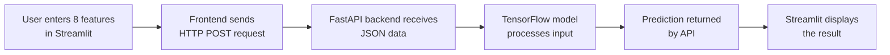

This section explains the overall architecture of the project in a simple and progressive way. The purpose is to help understand how the different parts of the application are connected and how data moves from the user interface to the machine learning model and back to the screen.

Even though this is a small project, it follows the same general idea used in many real-world AI applications. Instead of putting everything in one single file, the application is separated into different parts, and each part has a clear responsibility. This makes the project easier to understand, easier to maintain, and easier to improve later.

In this project, the architecture is divided into **three main layers**:

* the **model layer**, which is responsible for machine learning
* the **backend layer**, which is responsible for communication and prediction requests
* the **frontend layer**, which is responsible for user interaction

These three layers work together to create a complete end-to-end AI application.


## 1. Understanding the big picture

Before looking at each file, it is important to understand the general idea of the project.

The user does not interact directly with the TensorFlow model. Instead, the user interacts with a simple interface created with Streamlit. This interface collects the input values and sends them to the backend. The backend, built with FastAPI, receives these values, sends them to the TensorFlow model, gets the prediction, and returns the result to the frontend. Finally, the frontend displays the result to the user.

So, the data follows this path:

1. the user enters values in the Streamlit interface
2. Streamlit sends the data to FastAPI
3. FastAPI prepares the data and gives it to the TensorFlow model
4. the TensorFlow model makes a prediction
5. FastAPI returns the result
6. Streamlit displays the result

This flow is very important because it shows the role of each technology:

* **Streamlit** is used to build the user interface
* **FastAPI** is used to create the API
* **TensorFlow** is used to define and run the machine learning model


## 2. The model layer

The model layer is the part of the project that handles machine learning.

In this project, the file `model.py` is responsible for:

* generating sample training data
* building the TensorFlow model
* training the model
* saving the trained model to a file named `model.h5`

### Why do we need this file?

A machine learning model must first be trained before it can make predictions. Training means showing examples to the model so that it can learn patterns from the data.

In a real project, the training data would usually come from a CSV file, a database, or another source of real data. In this project, sample data is generated directly in Python to keep the example simple.

### What happens in `model.py`?

The file `model.py` usually performs the following steps:

1. create input data and target labels
2. define the neural network architecture
3. compile the model
4. train the model on the data
5. save the trained model to disk

### Why is the model saved?

After training, the model is saved as a file, usually `model.h5`. This is very useful because the backend does not need to train the model every time the application runs. Instead, it can simply load the saved model and use it immediately for prediction.

This separation is important:

* `model.py` is mainly for **training**
* `backend.py` is mainly for **inference**

### Training vs inference

These two words are very important:

* **training** means teaching the model using data
* **inference** means using the trained model to make a prediction on new data

In this project:

* training happens first, usually once or only when needed
* inference happens later, every time the user submits input values


## 3. The backend layer

The backend layer is the central part of the application. It acts as a bridge between the frontend and the machine learning model.

In this project, the file `backend.py` is responsible for:

* loading the trained model from `model.h5`
* creating an API with FastAPI
* receiving input data from the frontend
* validating and transforming the data
* sending the data to the TensorFlow model
* returning the prediction result as JSON

### Why do we need a backend?

One might ask: why not call the model directly from Streamlit?

The answer is that using a backend is a much cleaner and more realistic design. The backend allows the machine learning logic to be isolated from the user interface. This has several advantages:

* the model can be reused by other applications
* the frontend stays simple
* the code is better organized
* the project becomes closer to a production-style architecture

To make this concrete, consider the two diagrams below. The first shows what happens without a backend. The second shows the approach used in this project.

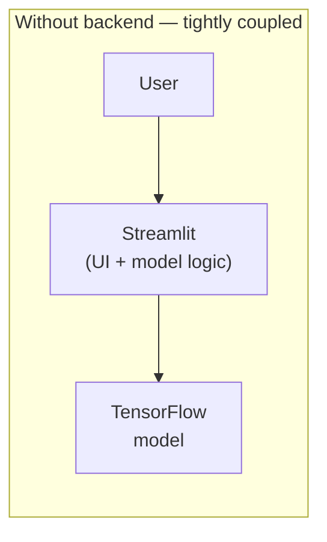

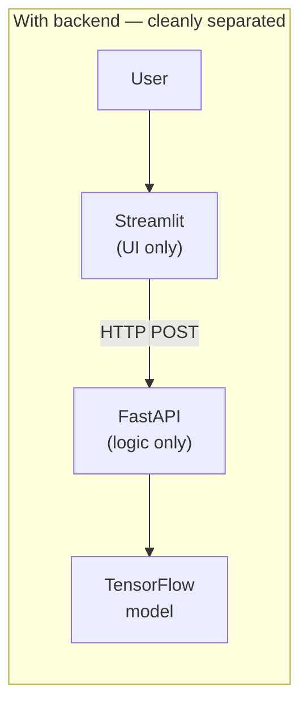

With a backend, the frontend only needs to know the API address. It does not import TensorFlow. It does not know how the model works. This separation is what makes the architecture scalable and maintainable.

### What is an API?

An **API** (Application Programming Interface) is a contract between two programs. It defines what requests can be made, what data must be provided, and what response will be returned.

In this project:

* Streamlit sends a request to FastAPI
* FastAPI receives the request
* FastAPI processes the data and returns a response

This communication usually happens through HTTP, the same protocol used by web browsers to load pages.

### What is an HTTP POST request?

HTTP defines several types of requests. The most common are:

| Method | Purpose |
|---|---|
| GET | Retrieve data from the server |
| POST | Send data to the server |
| PUT | Update existing data |
| DELETE | Remove data |

In this project, the frontend sends data to the backend using a **POST** request because the goal is to send 8 numeric values and receive a prediction in return. POST is the appropriate method when the client needs to send a payload to the server.

### What is JSON?

The data exchanged between the frontend and the backend is usually sent in **JSON** format.

JSON (JavaScript Object Notation) is a lightweight text format used to structure data. It is easy to read and very common in web applications and APIs.

For example, the frontend could send data like this:

```json
{
  "features": [1.2, 3.4, 5.6, 7.8, 0.9, 2.1, 4.3, 6.5]
}
```

The backend reads this JSON data, converts it into a NumPy array, and passes it to the TensorFlow model.

JSON was chosen because it is:
* human-readable
* language-independent (any programming language can parse it)
* natively supported by FastAPI and the Python `requests` library
* the standard format for REST APIs

### Why convert the data?

Machine learning models do not work directly with raw JSON text. They need numerical arrays with the right shape.

That is why the backend prepares the data before prediction. This step may include:

* converting the list into a NumPy array
* reshaping the array
* making sure the values are numeric
* making sure the model receives the expected format

The diagram below shows what data transformation happens inside the backend before the model is called:

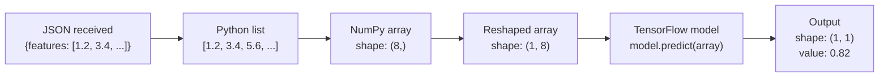

This step is very important because machine learning models are sensitive to input format.


## 4. How all layers work together

Now let us connect everything step by step.

### Step 1: the user enters data

The process starts when the user types 8 numeric values into the Streamlit interface.

These values are the input of the machine learning system.

### Step 2: the frontend sends the request

When the user submits the form, Streamlit sends the data to the FastAPI backend using an HTTP POST request.

The data is usually sent in JSON format.

### Step 3: the backend receives and prepares the data

FastAPI receives the request and extracts the values.

Then, the backend converts the data into the format expected by TensorFlow. This often means creating a NumPy array and reshaping it correctly.

### Step 4: the model makes a prediction

The backend passes the prepared input to the trained TensorFlow model.

The model performs inference and generates a prediction.

Depending on the project, this prediction could be:

* a class such as 0 or 1
* a probability such as 0.87
* a label such as "positive" or "negative"

### Step 5: the backend returns the result

Once the prediction is available, the backend sends the result back to the frontend in JSON format.

### Step 6: the frontend displays the result

Finally, Streamlit receives the response and shows the prediction to the user in a simple way.

This completes one full prediction cycle.


## 5. Why this architecture is useful

This architecture is useful because it separates the project into clear and independent parts.

### Clear separation of responsibilities

Each component has one main responsibility:

* **TensorFlow** handles the machine learning logic
* **FastAPI** handles communication and prediction requests
* **Streamlit** handles the user interface

This makes the project easier to understand because each file has a clear purpose.

### Easier maintenance

If you want to improve the model, you can modify `model.py` without changing the frontend.

If you want to change the user interface, you can modify `frontend.py` without changing the model logic.

If you want to add validation or new API routes, you can modify `backend.py`.

This separation makes maintenance easier.

### Better scalability

Even though this is a simple project, the structure can grow into a more advanced system.

For example, later you could:

* replace the sample data with real data
* train a better model
* deploy the backend on a cloud server
* improve the Streamlit interface
* add authentication
* connect a database

Because the project is already separated into layers, these improvements become easier to implement.


## 6. Analogy

A simple way to understand the architecture is to compare it to a restaurant:

* the **frontend** is the waiter who takes your order
* the **backend** is the kitchen manager who receives the order and sends it to the right place
* the **model** is the cook who prepares the final result

The user talks to the waiter, not directly to the cook.

In the same way, the user interacts with Streamlit, not directly with TensorFlow.

The backend is the middle layer that connects everything.

This analogy helps explain why different parts of the application have different roles.


## 7. Final idea to remember

The most important thing to remember is that this project is not only about training a model. It is about showing how a machine learning model can become part of a complete application.

This is why the architecture matters.

The project teaches three essential ideas:

1. a model can be trained and saved
2. a backend can load the model and expose it through an API
3. a frontend can send user input and display the prediction

Together, these ideas form the foundation of many modern AI applications.

</details>

---

<details>
<summary>3 - Project Structure</summary>

<br/>

```text
.
├── backend.py
├── frontend.py
├── model.py
├── README.md
└── requirements.txt
```

This section presents the file organization of the project. Understanding the structure of the project is very important because it helps answer a simple question: **where does each part of the application belong?**

Instead of putting everything in one large file, the project is divided into several files, and each file has a specific role. This makes the code easier to read, easier to debug, and easier to maintain.

In this project, each file corresponds to one important part of the application:

* one file for training the machine learning model
* one file for the backend API
* one file for the frontend interface
* one file for dependencies
* one file for documentation

This organization is simple, clean, and very common in introductory machine learning projects.

---

## 1. Why project structure matters

When starting out, it is common to place everything in a single file. This may work for very small experiments, but it quickly becomes difficult to manage.

For example, if one file contains:

* the model training code
* the API code
* the frontend code
* the installation instructions

then the project becomes confusing.

By separating the project into multiple files, we make each part easier to understand.

A good project structure helps you:

* know where to find the code you need
* understand the purpose of each file
* avoid mixing unrelated logic together
* improve the project more easily later

In other words, the project structure is like the blueprint of the application.

---

## 2. `model.py`

The file `model.py` contains the machine learning logic of the project.

Its role is to:

* generate the data
* define the TensorFlow model
* train the model
* save the trained model

### What does this file do?

This file is responsible for the **training phase**.

That means it is the file that teaches the neural network how to learn from data. In this project, the data is generated directly in Python to keep the example simple. In a real-world project, this data could come from a CSV file, a database, or another external source.

### Why is this file separate?

The training code is placed in its own file because training is a specific task. It is usually done before running the application for users.

This separation is useful because:

* the model does not need to be retrained every time the app starts
* the backend can simply load the saved model
* the project stays organized

### What is saved after training?

After training, the model is stored in a file such as `model.h5`.

This saved file is important because it contains the learned parameters of the neural network. Later, the backend will load this file and use it to make predictions.

### Key idea

`model.py` is mainly for **building and training** the model.

It is not the file that the user interacts with directly.

---

## 3. `backend.py`

The file `backend.py` contains the FastAPI server.

Its role is to:

* load the trained model
* define the API endpoint `/predict`
* receive input data
* perform inference
* return the prediction result

### What does this file do?

This file acts as the **middle layer** of the application.

It receives requests from the frontend, prepares the input data, sends it to the model, gets the prediction, and sends the result back.

### Why do we need a backend?

A backend is useful because it separates the machine learning model from the user interface.

Instead of letting the frontend access the model directly, the frontend sends a request to the backend, and the backend handles the prediction.

This makes the application:

* more organized
* more realistic
* easier to reuse in other systems

### What is `/predict`?

The endpoint `/predict` is the route used by the frontend to ask for a prediction.

In simple words, it is the address in the API where the frontend sends the 8 input values.

For example, the frontend may send data to something like:

```text
http://127.0.0.1:8000/predict
```

The backend receives the values, runs the model, and returns the result.

### Key idea

`backend.py` is responsible for **communication and prediction**.

It is the connection between the frontend and the trained model.

---

## 4. `frontend.py`

The file `frontend.py` contains the Streamlit interface.

Its role is to:

* display input fields
* collect the 8 numeric values
* send requests to the backend
* show the prediction result

### What does this file do?

This file creates the part of the application that the user can see and use.

The frontend is where the user enters the data and clicks a button to request a prediction.

### Why is this file separate?

The frontend is separated from the backend and the model because its role is different.

The frontend is not responsible for:

* training the model
* storing the model
* running the internal prediction logic

Its responsibility is to provide a simple and clear interface for the user.

### What happens in this file?

In general, `frontend.py` will:

1. display numeric input fields
2. wait for the user to enter values
3. send these values to the FastAPI backend
4. receive the response
5. display the prediction on the page

### Key idea

`frontend.py` is the **visible part** of the application.

It is what the user interacts with directly.

---

## 5. `requirements.txt`

The file `requirements.txt` contains the Python dependencies needed to run the project.

### What is a dependency?

A dependency is a library or package that the project needs in order to work.

For this project, examples of dependencies may include:

* `tensorflow`
* `fastapi`
* `uvicorn`
* `streamlit`
* `requests`
* `numpy`

### Why is this file important?

This file makes installation much easier.

Instead of installing each package one by one manually, we can install everything with a single command such as:

```bash
pip install -r requirements.txt
```

This is especially useful when:

* sharing the project with another person
* moving the project to another computer
* recreating the same environment later

### Key idea

`requirements.txt` is not Python code for the application itself.

It is a support file that lists all the packages needed for the project.

---

## 6. `README.md`

The file `README.md` contains the project documentation.

Its role is to explain:

* what the project does
* how the project is organized
* how to install dependencies
* how to run the files
* how the architecture works

### Why is this file important?

A project is not complete if the code exists but nobody knows how to use it.

The README file is often the first file that another person reads when discovering the project.

It acts like a guide.

A good `README.md` helps the reader understand:

* the purpose of the project
* the technologies used
* the file structure
* the execution steps

### Why is it called `.md`?

The extension `.md` means **Markdown**.

Markdown is a lightweight format used to write structured documentation with titles, lists, code blocks, links, and other readable elements.

### Key idea

`README.md` is not part of the application logic, but it is an essential file for explaining and presenting the project properly.

---

## 7. How all files work together

Now let us connect all the files together.

### Step 1: `model.py`

This file trains the TensorFlow model and saves it.

### Step 2: `backend.py`

This file loads the saved model and creates the API used for prediction.

### Step 3: `frontend.py`

This file displays the interface and sends the user's input to the backend.

### Step 4: `requirements.txt`

This file makes sure that all required Python libraries are installed.

### Step 5: `README.md`

This file explains how to install, understand, and run the project.

Together, these files form a complete and organized machine learning application.

---

## 8. Analogy

You can think of the project structure like a small company where each person has a different job:

* `model.py` is the specialist who learns and builds the prediction system
* `backend.py` is the coordinator who receives requests and sends them to the model
* `frontend.py` is the receptionist who interacts with the user
* `requirements.txt` is the list of tools needed by the team
* `README.md` is the instruction manual that explains how everything works

Each file has its own responsibility, and together they make the whole project function correctly.

---

## 9. Final idea to remember

The most important idea is that each file exists for a reason.

This structure helps understand that a real application is usually divided into separate parts, and each part solves a specific problem.

In this project:

* `model.py` handles training
* `backend.py` handles prediction requests
* `frontend.py` handles user interaction
* `requirements.txt` handles dependencies
* `README.md` handles documentation

This is a simple but very good structure for building a first end-to-end AI application.

</details>

---

<details>
<summary>4 - Neural Network Explanation</summary>

<br/>

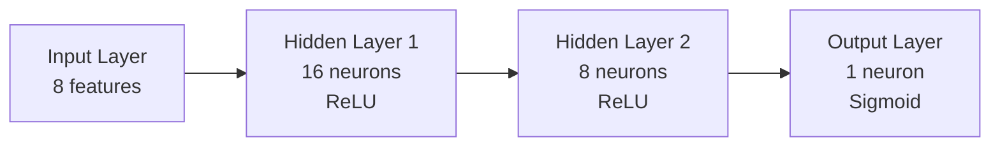

This section explains the structure of the neural network used in the project. The goal is to help understand what the model looks like, how information moves through it, and why it is able to produce a prediction.

At first, a neural network may look complicated, but in this project the idea is simple. The model receives **8 numeric input values**, transforms them step by step through hidden layers, and produces **one final output value** between **0 and 1**.

This output is used for **binary classification**, which means the model must choose between **two possible classes**.

For example:

* class `0`
* class `1`

The network does not simply guess randomly. During training, it learns patterns from the data. Later, during prediction, it uses what it has learned to estimate which class is more likely.

---

## 1. What is this neural network doing?

This model is a **binary classification neural network**.

That means its goal is to decide between two possible categories.

It receives **8 numeric input values** and produces **one output value between 0 and 1**.

In general:

* if the output is close to **0**, the model tends to predict class **0**
* if the output is close to **1**, the model tends to predict class **1**

So the final output can be interpreted as a kind of confidence or probability for the positive class.

For example:

* `0.10` means the model is leaning strongly toward class `0`
* `0.49` means the model is uncertain
* `0.85` means the model is leaning strongly toward class `1`

In many cases, we use a threshold such as `0.5`:

* output < `0.5` → predict class `0`
* output >= `0.5` → predict class `1`

This is why the final layer uses the **sigmoid** activation function: it transforms the output into a value between `0` and `1`.

---

## 2. General idea of how a neural network works

A neural network is a system made of connected layers.

Each layer receives numbers, performs mathematical operations, and passes the result to the next layer.

You can think of it as a chain of transformations:

1. the input layer receives the original data
2. the hidden layers learn useful patterns
3. the output layer produces the final prediction

The network learns by adjusting internal parameters called **weights** and **biases**.

At the beginning of training, these values are random, so the model makes poor predictions.

During training, the network compares its predictions with the correct answers and gradually adjusts itself to improve.

This learning process is what allows the model to become useful.

The following diagram shows the complete training loop that repeats for each epoch:

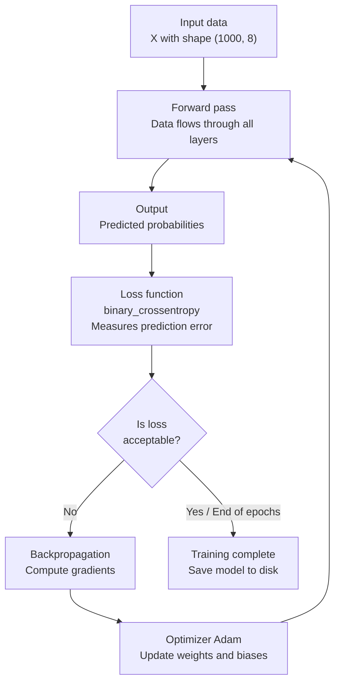

This loop runs for every batch of data during each epoch. After 10 epochs, the model has seen all training data 10 times and has adjusted its internal parameters to minimize the prediction error.

---

## 3. Understanding the input layer

The first part of the model is the **input layer**.

The network expects an input vector of size **8**, because each example in this project contains **8 features**.

A feature is simply an input value used by the model.

Example of one input sample:

```python
[0.2, 0.8, 0.1, 0.7, 0.9, 0.3, 0.5, 0.6]
```

This means the model receives 8 numbers at the same time.

### Key idea

The input layer does not make a decision by itself.

Its role is simply to receive the data and pass it to the next layer.

So when we say:

```python
input_shape=(8,)
```

it means:

* each sample has 8 values
* the model expects exactly 8 features for one prediction

If the model expects 8 features and receives only 7, or receives 10, it will not work correctly.

That is why the shape of the input is very important in machine learning.

---

## 4. The first hidden layer

The first hidden layer is:

```python
Dense(16, activation='relu', input_shape=(8,))
```

This means:

* the layer is fully connected
* it contains **16 neurons**
* it uses the **ReLU** activation function
* it receives **8 input values**

### What does "Dense" mean?

A **Dense** layer means that each neuron in this layer receives information from all values coming from the previous layer.

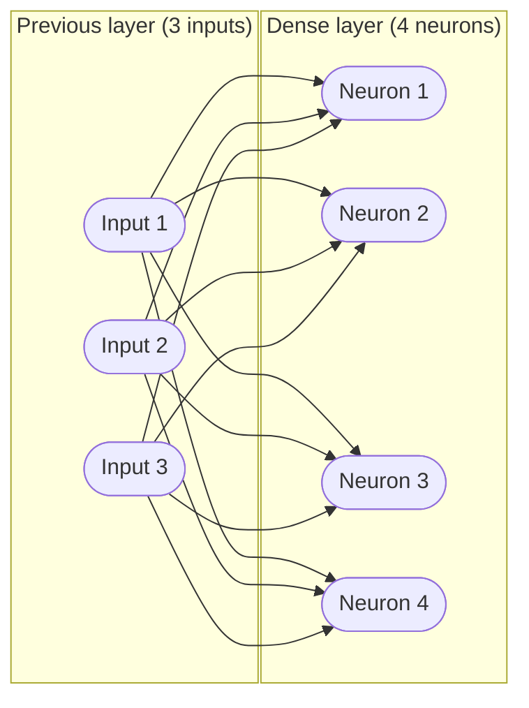

Every input is connected to **every** neuron — that is why this layer is called **Dense** (fully connected).

So here, each of the 16 neurons looks at the 8 input values and computes a result.

### What does this layer do?

This layer:

* receives the 8 input values
* multiplies them by weights
* adds biases
* applies the activation function
* produces 16 output values

So the 8 original values are transformed into 16 learned values.

### Why 16 neurons?

There is no magical rule saying it must be exactly 16. It is a design choice.

Using 16 neurons allows the network to learn richer internal patterns than the original 8 raw features.

In simple words, the layer creates a more informative representation of the input data.

### What is ReLU?

ReLU stands for **Rectified Linear Unit**.

Its formula is simple:

```python
f(x) = max(0, x)
```

This means:

* if the value is negative, ReLU returns `0`
* if the value is positive, ReLU returns the value itself

Examples:

* `ReLU(-3)` → `0`
* `ReLU(0)` → `0`
* `ReLU(4.5)` → `4.5`

### Why use ReLU?

ReLU is one of the most common activation functions in hidden layers because:

* it is simple
* it is fast
* it works well in many neural networks

It helps the network learn non-linear patterns, which means patterns that are more complex than a simple straight-line relationship.

This is very important because most real data is not perfectly linear.

---

## 5. The second hidden layer

The second hidden layer is:

```python
Dense(8, activation='relu')
```

This means:

* the layer receives the 16 outputs from the previous layer
* it contains **8 neurons**
* it also uses **ReLU**

### What does this layer do?

This layer takes the learned representation created by the first hidden layer and transforms it again.

Its role is to refine the information before the final decision.

So:

* the first hidden layer extracts useful patterns
* the second hidden layer refines these patterns further

It produces 8 new values, which are then sent to the output layer.

### Why reduce from 16 neurons to 8 neurons?

This is another design choice.

The first hidden layer expands the representation from 8 to 16 values, and the second layer compresses it to 8 learned features.

This can help the network keep useful information while simplifying it before the final prediction.

For this project, this is a good architecture because it is:

* small
* easy to understand
* powerful enough for a simple classification task

---

## 6. The output layer

The output layer is:

```python
Dense(1, activation='sigmoid')
```

This means:

* the layer has **1 neuron**
* it uses the **sigmoid** activation function

### Why only 1 neuron?

Because this is a **binary classification** problem.

We only want one final output representing the probability of class `1`.

If the task had multiple classes, the output layer would be different.

### What does sigmoid do?

The sigmoid function transforms any number into a value between `0` and `1`.

This is useful because the output can then be interpreted as a probability-like value.

Examples:

* a raw value may become `0.12`
* another raw value may become `0.76`
* another raw value may become `0.93`

### Why is sigmoid useful here?

Because we want the final result to be easy to interpret.

With sigmoid:

* values close to `0` suggest class `0`
* values close to `1` suggest class `1`

This makes the output layer ideal for binary classification.

---

## 7. How information moves through the network

Let us now describe the complete flow of one input sample.

Suppose the model receives:

```python
[0.2, 0.8, 0.1, 0.7, 0.9, 0.3, 0.5, 0.6]
```

### Step 1: input layer

The model receives the 8 values.

### Step 2: first hidden layer

The first hidden layer transforms these 8 values into 16 new values using weights, biases, and ReLU.

### Step 3: second hidden layer

The second hidden layer takes those 16 values and transforms them into 8 new learned values.

### Step 4: output layer

The output layer takes those 8 values and produces a single number between 0 and 1.

For example:

```python
0.82
```

This result means that the model considers class `1` more likely.

If the threshold is `0.5`, then the final predicted class would be:

```python
1
```

---

## 8. What are neurons actually doing?

The word **neuron** can sometimes seem mysterious at first.

In practice, a neuron is just a small mathematical unit.

A neuron usually does this:

1. receives several input values
2. multiplies each input by a weight
3. adds everything together
4. adds a bias
5. applies an activation function

So a neuron is not magic. It is a mathematical transformation.

The following diagram shows exactly what happens inside a single neuron with 3 inputs:

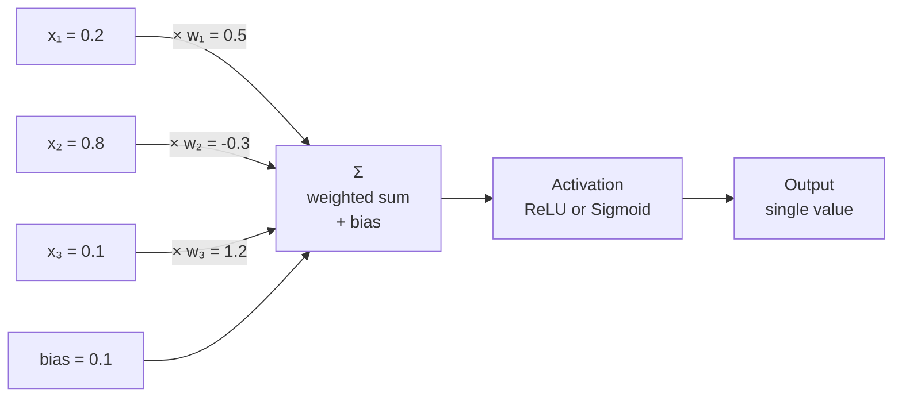

The mathematical formula for one neuron is:

```text
output = activation( x₁·w₁ + x₂·w₂ + x₃·w₃ + bias )
```

For example, with the values above:

```text
z = (0.2 × 0.5) + (0.8 × -0.3) + (0.1 × 1.2) + 0.1
z = 0.10 - 0.24 + 0.12 + 0.10
z = 0.08

output = ReLU(0.08) = 0.08
```

Every neuron in the network performs this same operation with its own set of weights and bias. The power of a neural network comes from having hundreds or thousands of these simple computations organized into layers and optimized together during training.

The power of neural networks comes from having many neurons working together across multiple layers.

---

## 9. What are weights and biases?

These are two of the most important concepts in a neural network.

### Weights

Weights determine how important each input is.

If a weight is large, that input has a stronger effect on the neuron.

If a weight is small, that input has less influence.

A negative weight means the input has an inhibiting effect — it pushes the neuron's output lower.

During training, the network adjusts every single weight in every layer. For a network like ours with architecture 8 → 16 → 8 → 1, the total number of weight parameters can be calculated as follows:

```text
Layer 1:  8 inputs  × 16 neurons = 128 weights  + 16 biases  = 144 parameters
Layer 2: 16 inputs  ×  8 neurons = 128 weights  +  8 biases  = 136 parameters
Layer 3:  8 inputs  ×  1 neuron  =   8 weights  +  1 bias    =   9 parameters

Total = 144 + 136 + 9 = 289 trainable parameters
```

All 289 parameters are adjusted during training to minimize the prediction error.

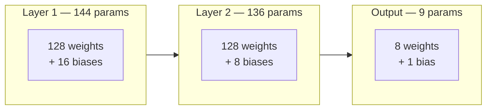

### Biases

A bias is an additional value added to the neuron's calculation.

It gives the neuron more flexibility. Without bias, the neuron could only produce zero output when all inputs are zero. With bias, the neuron can shift its activation threshold and learn more complex patterns.

Think of bias as the intercept in a linear equation. Just as `y = ax + b` would be less flexible without `b`, a neuron without bias is less expressive.

### During training

The model learns by adjusting these weights and biases.

This is the core of machine learning.

The network improves because training changes its internal parameters to reduce prediction errors.

---

## 10. Why do we need hidden layers?

One may ask: why not go directly from 8 inputs to 1 output?

That is possible in very simple models, but hidden layers allow the network to learn more complex relationships.

The hidden layers help the network:

* combine features
* detect patterns
* build intermediate representations
* improve prediction quality

Without hidden layers, the model would be much more limited.

The hidden layers are what allow the network to "learn" useful internal features automatically.

---

## 11. Why is this architecture a good choice?

This architecture is a good choice because it is simple but meaningful.

### It is small

The network is not too deep and not too large, so it is easier to understand.

### It shows the main ideas

It introduces important concepts such as:

* input layer
* hidden layers
* neurons
* ReLU
* sigmoid
* binary classification

### It is realistic enough

Even though the project is small, the architecture looks like a real neural network used for a classification task.

This makes it a good learning example.

---

## 12. Analogy

You can think of the neural network as a sequence of decision steps.

Imagine you are trying to decide whether an object belongs to class `0` or class `1`.

* the **input layer** receives the raw information
* the **first hidden layer** looks for simple patterns
* the **second hidden layer** combines these patterns into more meaningful signals
* the **output layer** makes the final decision

So the network gradually transforms raw data into a prediction.

This is why neural networks are often described as systems that learn representations step by step.

---

## 13. Final idea to remember

The most important thing to remember is that this neural network takes **8 input features** and transforms them through two hidden layers to produce **one final output** for binary classification.

Its architecture is:

* **Input layer** → receives 8 features
* **Hidden layer 1** → 16 neurons with ReLU
* **Hidden layer 2** → 8 neurons with ReLU
* **Output layer** → 1 neuron with sigmoid

This means the model:

1. receives the input data
2. transforms it step by step
3. learns internal patterns
4. returns a value between 0 and 1
5. uses this value to predict one of two classes

This is a simple but very good example of how a neural network works in practice.

</details>

---

<details>
<summary>5 - Activation Functions</summary>

<br/>

Activation functions are one of the most essential components of a neural network. Without them, a network with multiple layers would be mathematically equivalent to a single-layer network, no matter how deep it is. This is because stacking linear transformations always produces another linear transformation. Activation functions break this linearity and allow the network to model complex, non-linear patterns in data.

The following diagram shows where an activation function sits in the computation of a single layer:

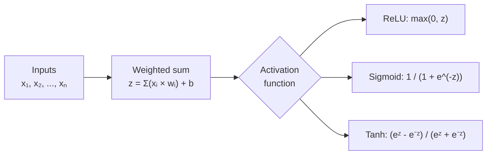

Each activation function produces a different range of output values and has different mathematical properties. The choice of activation function depends on the role of the layer in the network.

---

### Comparison of common activation functions

| Function | Output range | Used in | Key property |
|---|---|---|---|
| ReLU | [0, +∞) | Hidden layers | Simple, fast, prevents vanishing gradient |
| Sigmoid | (0, 1) | Output layer (binary) | Outputs a probability-like value |
| Tanh | (-1, 1) | Hidden layers | Zero-centered, stronger gradients than sigmoid |
| Softmax | (0, 1) sum=1 | Output layer (multi-class) | Distributes probability across classes |

---

<details>
<summary><strong>Why do we use activation functions?</strong></summary>

Activation functions allow the neural network to learn **non-linear relationships**.

Without activation functions, the neural network would behave like a simple linear model, even if it had many layers.

To understand why, consider this: if every layer just computes `z = W·x + b`, then stacking two layers gives:

```text
Layer 1: z₁ = W₁·x + b₁
Layer 2: z₂ = W₂·z₁ + b₂ = W₂·(W₁·x + b₁) + b₂ = (W₂·W₁)·x + (W₂·b₁ + b₂)
```

This is still a linear function of `x`. No matter how many layers are added, without activation functions, the network can only learn linear relationships. Real-world data — images, text, sensor readings — is almost always non-linear. Activation functions are what give neural networks their expressive power.

</details>

<details>
<summary><strong>ReLU explanation</strong></summary>

## ReLU

ReLU stands for **Rectified Linear Unit**.

Formula:

```text
ReLU(x) = max(0, x)
```

This means:

* if the value is negative, the output becomes 0,
* if the value is positive, the output stays unchanged.

The behavior of ReLU can be visualized as a "ramp" function:

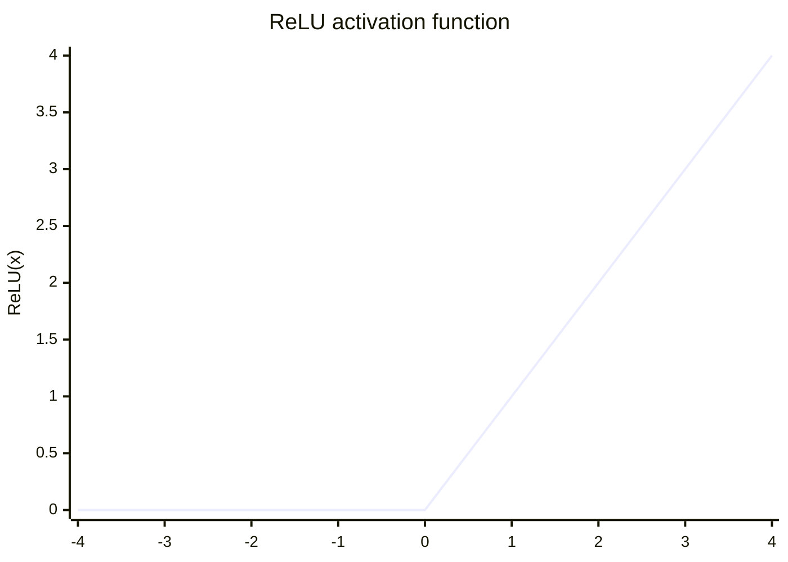

For negative inputs, the output is flat at 0. For positive inputs, the output grows linearly. This asymmetry is what makes ReLU interesting — it introduces non-linearity while remaining very simple to compute.

### Why ReLU is useful

* very simple and efficient,
* helps deep networks train faster,
* avoids the **vanishing gradient** problem that affects older functions like sigmoid in hidden layers,
* most neurons only activate for relevant inputs, creating sparse activations.

### Potential issue: dying ReLU

One known issue is that if a neuron always receives negative inputs, its output is always 0 and it stops learning. This is called the "dying ReLU" problem. Variants like **Leaky ReLU** address this by using a small slope for negative values instead of 0.

</details>

<details>
<summary><strong>Sigmoid explanation</strong></summary>

## Sigmoid

The sigmoid activation function transforms any input value into a number between **0 and 1**.

Formula:

```text
sigmoid(x) = 1 / (1 + e^(-x))
```

Some examples of sigmoid output:

| Input x | sigmoid(x) |
|---|---|
| -10 | ≈ 0.000045 |
| -2 | ≈ 0.119 |
| 0 | 0.500 |
| 2 | ≈ 0.881 |
| 10 | ≈ 0.999995 |

For very large positive values, sigmoid saturates near 1. For very large negative values, it saturates near 0. Around 0, it produces values close to 0.5, representing maximum uncertainty.

### Why sigmoid is useful here

Because this project is doing **binary classification**, the output should represent a probability between 0 and 1.

Examples:

* output = 0.12 → likely class 0
* output = 0.87 → likely class 1

Sigmoid is ideal for the **output layer** of a binary classifier because it maps any real number to a value that can be interpreted as a probability.

### Why sigmoid is generally not used in hidden layers

Although sigmoid was historically popular in hidden layers, it has been largely replaced by ReLU for the following reasons:

* its output is not centered around 0, which can slow down learning,
* for very large or very small values, its gradient becomes nearly 0 — this is called the **vanishing gradient** problem, which prevents deep networks from learning efficiently.

In this project, sigmoid is only used in the output layer, which is the correct and recommended practice.

</details>

</details>

---

<details>
<summary>6 - Loss Function and Optimizer</summary>

<br/>

Training a neural network is fundamentally an optimization problem. The network has hundreds of parameters (weights and biases), and the goal of training is to find the combination of values that produces the best predictions on the training data.

To measure "how wrong" the model is, we use a **loss function**. To iteratively improve the parameters, we use an **optimizer**. These two components work together at every training step.

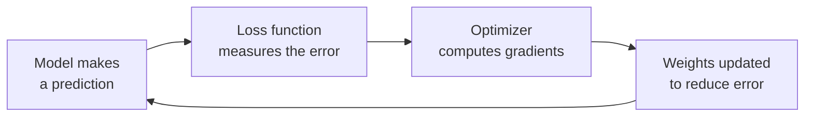

---

<details>
<summary><strong>Model compilation details</strong></summary>

The model is compiled with:

```python
model.compile(
    optimizer='adam',
    loss='binary_crossentropy',
    metrics=['accuracy']
)
```

## Optimizer: Adam

Adam (Adaptive Moment Estimation) is a widely used optimization algorithm in deep learning.

Its role is to update the model weights during training in order to reduce the prediction error.

Adam is an improvement over basic **Stochastic Gradient Descent (SGD)**. While SGD uses a single fixed learning rate for all parameters, Adam adapts the learning rate for each parameter individually. This makes it much more efficient in practice, especially for problems where features have different scales or frequencies.

The following diagram shows conceptually how gradient descent finds the minimum loss:

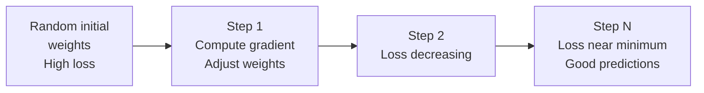

Why Adam is popular:

* efficient — converges faster than basic SGD,
* works well in many practical cases without much tuning,
* handles sparse gradients well,
* adapts learning rates automatically based on past gradients.

## Loss function: binary_crossentropy

Binary cross-entropy is the standard loss function used for **binary classification problems**.

It measures how far the predicted probability is from the true label.

The formula is:

```text
Loss = -[ y · log(ŷ) + (1 - y) · log(1 - ŷ) ]
```

Where:
- `y` is the true label (0 or 1)
- `ŷ` is the predicted probability (between 0 and 1)

Let us look at concrete examples to understand what this means:

| True label | Prediction | Loss | Interpretation |
|---|---|---|---|
| 1 | 0.95 | ≈ 0.05 | Very good prediction — low loss |
| 1 | 0.50 | ≈ 0.69 | Uncertain prediction — moderate loss |
| 1 | 0.05 | ≈ 3.00 | Very wrong prediction — high loss |
| 0 | 0.05 | ≈ 0.05 | Very good prediction — low loss |
| 0 | 0.95 | ≈ 3.00 | Very wrong prediction — high loss |

The optimizer's job is to reduce this loss by adjusting the model's weights.

## Metric: accuracy

Accuracy measures how often the model predicts the correct class.

It is computed by applying a threshold of 0.5 to the predicted probabilities:

```text
if prediction >= 0.5 → predicted class = 1
if prediction <  0.5 → predicted class = 0

accuracy = number of correct predictions / total predictions
```

Example:

* if 90 predictions out of 100 are correct,
* the accuracy is 90%.

Note that accuracy is used only for **monitoring** during training. The actual learning is driven by the loss function, not the accuracy metric.

## What happens during training epoch by epoch?

Each **epoch** is one complete pass through the entire training dataset. During each epoch, the model sees all 1000 samples, makes predictions, computes the loss, and updates its weights.

After 10 epochs, the training output might look like this:

```text
Epoch 1/10 — loss: 0.6821 — accuracy: 0.5930
Epoch 2/10 — loss: 0.5934 — accuracy: 0.7210
Epoch 3/10 — loss: 0.4812 — accuracy: 0.8140
Epoch 4/10 — loss: 0.3765 — accuracy: 0.8620
Epoch 5/10 — loss: 0.2991 — accuracy: 0.8960
...
Epoch 10/10 — loss: 0.1543 — accuracy: 0.9450
```

The loss decreases and the accuracy increases as the model improves. This is the expected pattern for a model that is learning correctly.

</details>

</details>

---

<details>
<summary>7 - Training Data Logic</summary>

<br/>

One of the first questions in any machine learning project is: where does the data come from? In a production system, training data usually comes from a real source — a database, sensor logs, user events, or a curated dataset file. In this project, the data is generated synthetically using NumPy. This keeps the project self-contained and runnable without any external data files, while still demonstrating a real and complete ML pipeline.

<details>
<summary><strong>How the dummy dataset is created</strong></summary>

The training data is generated using:

```python
X = np.random.rand(1000, 8)
y = (X.sum(axis=1) > 4).astype(int)
```

## Explanation

### `X = np.random.rand(1000, 8)`

This creates a matrix of random values:

* **1000 rows** — each row is one training sample
* **8 columns** — each column is one feature
* each value is drawn uniformly between 0 and 1

Visually, the data matrix looks like this:

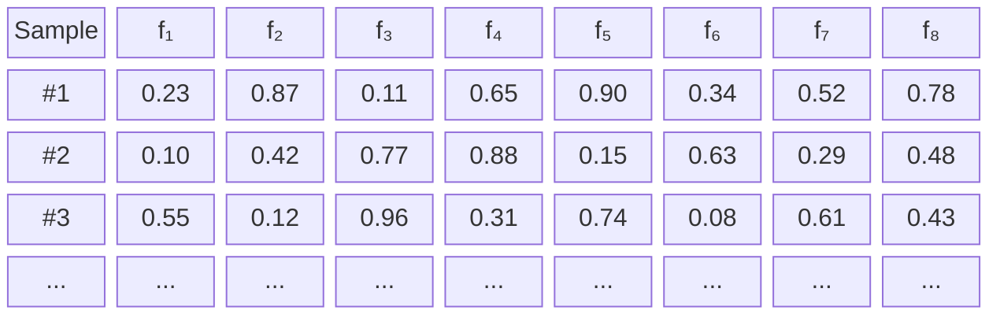

### `X.sum(axis=1) > 4`

For each row, the 8 feature values are summed. Since each value is between 0 and 1, the maximum possible sum per row is 8 and the minimum is 0. The average sum is 4 (since there are 8 features, each uniformly distributed between 0 and 1).

* if the sum is greater than 4, the sample is labeled **1** (above average),
* otherwise, it is labeled **0** (below average).

This creates a balanced classification problem. Roughly half the samples will have a sum greater than 4, and roughly half will not.

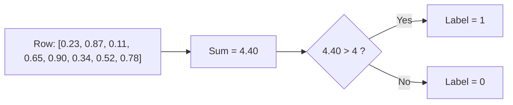

### Why this labeling rule works well for a neural network

The labeling rule `sum > 4` is learnable but not trivially simple. The model cannot solve it with a single threshold on one feature — it needs to combine all 8 features together. This forces the network to use its multiple layers and neurons to detect the combined pattern, making it a good exercise for a real neural network.

### Why this is useful for the project

This is not a real dataset, but it is useful for:

* testing the full ML pipeline end to end,
* understanding the integration between training, backend, and frontend,
* building a reproducible example that runs on any machine without external data.

### What would change with real data?

If this project were adapted to use real data, the `generate_data()` function would be replaced by code that:

* reads a CSV file using `pandas`,
* cleans and preprocesses the data,
* splits it into training and test sets,
* normalizes the features if needed.

The rest of the code — the model architecture, the backend, the frontend — would remain exactly the same.

</details>

</details>

---

<details>
<summary>8 - File `model.py`</summary>

<br/>

```python
import tensorflow as tf
from tensorflow.keras.models import Sequential
from tensorflow.keras.layers import Dense
import numpy as np

# Generate dummy training data
def generate_data():
    X = np.random.rand(1000, 8)  # 1000 samples, 8 features
    y = (X.sum(axis=1) > 4).astype(int)  # 1 if the sum of the features > 4, otherwise 0
    return X, y

# Create and train a simple model
def train_model():
    X, y = generate_data()
    model = Sequential([
        Dense(16, activation='relu', input_shape=(8,)),
        Dense(8, activation='relu'),
        Dense(1, activation='sigmoid')
    ])
    model.compile(optimizer='adam', loss='binary_crossentropy', metrics=['accuracy'])
    model.fit(X, y, epochs=10)
    model.save('model.h5')

if __name__ == "__main__":
    train_model()
```

<details>
<summary><strong>Line-by-line explanation of <code>model.py</code></strong></summary>

## Imports

```python
import tensorflow as tf
from tensorflow.keras.models import Sequential
from tensorflow.keras.layers import Dense
import numpy as np
```

These imports are used to:

* build the neural network with TensorFlow/Keras,
* manipulate arrays with NumPy.

## Data generation function

```python
def generate_data():
    X = np.random.rand(1000, 8)
    y = (X.sum(axis=1) > 4).astype(int)
    return X, y
```

This function creates:

* the input matrix `X`,
* the target labels `y`.

## Training function

```python
def train_model():
```

This function groups all training steps.

```python
X, y = generate_data()
```

Loads the generated dataset.

```python
model = Sequential([
    Dense(16, activation='relu', input_shape=(8,)),
    Dense(8, activation='relu'),
    Dense(1, activation='sigmoid')
])
```

Defines the neural network architecture.

```python
model.compile(optimizer='adam', loss='binary_crossentropy', metrics=['accuracy'])
```

Prepares the model for training.

```python
model.fit(X, y, epochs=10)
```

Trains the model for 10 epochs.

```python
model.save('model.h5')
```

Saves the trained model to disk.

</details>

</details>

---

<details>
<summary>9 - File `backend.py`</summary>

<br/>

```python
from fastapi import FastAPI
from pydantic import BaseModel
import tensorflow as tf
import numpy as np

# Load the trained model
model = tf.keras.models.load_model('model.h5')

# Define the structure of the input data
class PredictionInput(BaseModel):
    features: list

app = FastAPI()

@app.post("/predict")
def predict(input: PredictionInput):
    features = np.array(input.features).reshape(1, -1)
    prediction = model.predict(features)
    return {"prediction": float(prediction[0, 0])}
```

<details>
<summary><strong>Detailed explanation of <code>backend.py</code></strong></summary>

## Model loading

```python
model = tf.keras.models.load_model('model.h5')
```

This loads the model saved previously by `model.py`.

## Pydantic class

```python
class PredictionInput(BaseModel):
    features: list
```

This defines the expected JSON format.

Example request:

```json
{
  "features": [0.1, 0.2, 0.3, 0.4, 0.5, 0.6, 0.7, 0.8]
}
```

## FastAPI application

```python
app = FastAPI()
```

Creates the backend application.

## Prediction endpoint

```python
@app.post("/predict")
def predict(input: PredictionInput):
```

This defines a POST endpoint at:

```text
/predict
```

## Reshaping the input

```python
features = np.array(input.features).reshape(1, -1)
```

The model expects a 2D array:

* 1 row = 1 sample
* 8 columns = 8 features

## Model prediction

```python
prediction = model.predict(features)
```

This sends the input to the neural network.

## Returning JSON

```python
return {"prediction": float(prediction[0, 0])}
```

The output is converted into a Python float and returned as JSON.

</details>

</details>

---

<details>
<summary>10 - File `frontend.py`</summary>

<br/>

```python
import streamlit as st
import requests

# FastAPI API URL
API_URL = "http://127.0.0.1:8000"

st.title("Prediction with TensorFlow, FastAPI and Streamlit")

features = [st.number_input(f"Feature {i+1}", format="%f") for i in range(8)]

if st.button("Predict"):
    response = requests.post(f"{API_URL}/predict", json={"features": features})
    if response.status_code == 200:
        prediction = response.json().get("prediction")
        st.success(f"The prediction is: {prediction}")
    else:
        st.error("Prediction error")
```

<details>
<summary><strong>Detailed explanation of <code>frontend.py</code></strong></summary>

## Streamlit import

```python
import streamlit as st
```

Used to create the user interface.

## Requests import

```python
import requests
```

Used to send HTTP requests to the FastAPI backend.

## API URL

```python
API_URL = "http://127.0.0.1:8000"
```

The frontend communicates with the backend running locally on port 8000.

## Title

```python
st.title("Prediction with TensorFlow, FastAPI and Streamlit")
```

Displays the application title.

## Input fields

```python
features = [st.number_input(f"Feature {i+1}", format="%f") for i in range(8)]
```

Creates 8 numeric input boxes.

## Prediction button

```python
if st.button("Predict"):
```

When the user clicks the button, the frontend sends the input data to the backend.

## POST request

```python
response = requests.post(f"{API_URL}/predict", json={"features": features})
```

The input is sent as JSON.

## Displaying result

```python
if response.status_code == 200:
    prediction = response.json().get("prediction")
    st.success(f"The prediction is: {prediction}")
else:
    st.error("Prediction error")
```

If the request is successful, the prediction is displayed.
Otherwise, an error message is shown.

</details>

</details>

---

<details>
<summary>11 - API Request / Response Flow</summary>

<br/>

Understanding the full request-response cycle is essential for building and debugging AI applications. Every time a user clicks the "Predict" button in the Streamlit interface, a complete chain of events is triggered. This chain involves multiple components, each playing a specific role, and the result travels back through the same chain to reach the user.

The following sequence diagram shows every step of this cycle in detail:

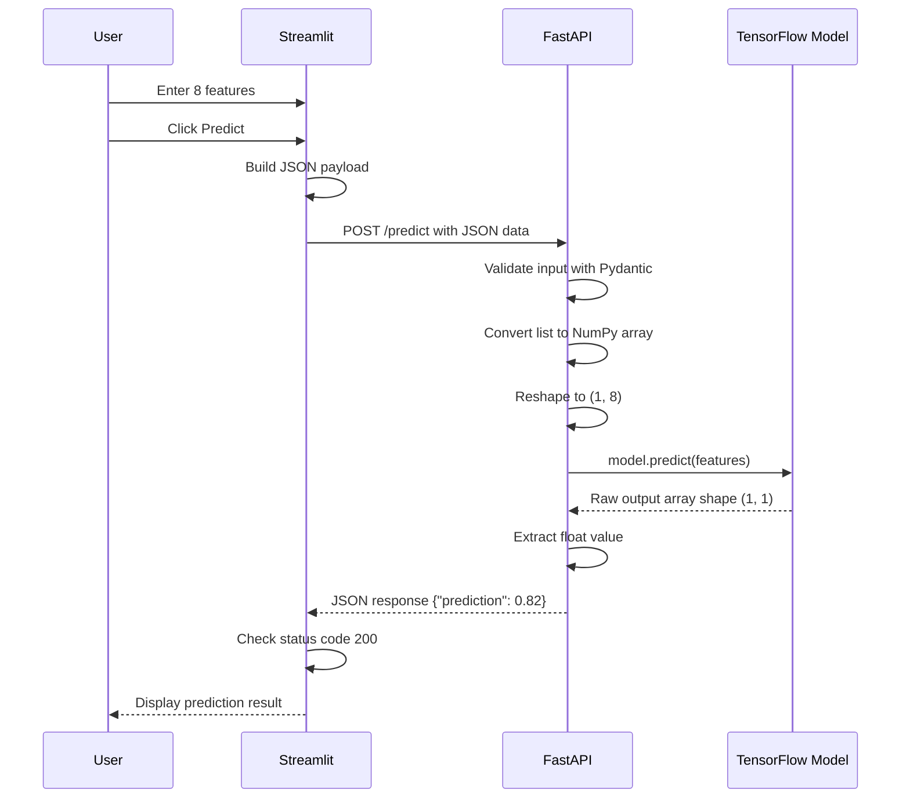

### What happens at each step

**Step 1 — User enters data**

The user types 8 numeric values into the Streamlit interface. These values represent the features of the sample to be classified. In a real application, these features could be measurements, sensor readings, or any numeric attributes relevant to the prediction task.

**Step 2 — Streamlit builds the JSON payload**

Before sending the request, Streamlit collects the 8 input values and packages them into a JSON object:

```json
{
  "features": [0.5, 0.8, 0.1, 0.6, 0.9, 0.4, 0.3, 0.7]
}
```

This JSON structure matches exactly what the FastAPI backend expects.

**Step 3 — HTTP POST request is sent**

Streamlit uses the Python `requests` library to send an HTTP POST request to the FastAPI server running locally at `http://127.0.0.1:8000/predict`. This is a synchronous call — Streamlit waits for the response before continuing.

**Step 4 — FastAPI validates the input**

FastAPI uses Pydantic to automatically validate the incoming JSON. If the data does not match the expected schema (for example, if a non-numeric value is sent), FastAPI returns a 422 error before even reaching the prediction logic. This validation layer protects the model from receiving malformed input.

**Step 5 — Data is transformed**

The validated list is converted into a NumPy array and reshaped from `(8,)` to `(1, 8)`. The shape `(1, 8)` means one sample with 8 features. TensorFlow requires this 2D shape to process a single prediction.

**Step 6 — The model makes a prediction**

The reshaped array is passed to `model.predict()`. TensorFlow runs the forward pass through all layers and returns a raw output array of shape `(1, 1)` containing a single float value between 0 and 1.

**Step 7 — The result is returned as JSON**

FastAPI extracts the float value from the output array and wraps it in a JSON response:

```json
{
  "prediction": 0.8234521746635437
}
```

**Step 8 — Streamlit displays the result**

Streamlit checks that the status code is 200 (success), extracts the prediction value from the response, and displays it to the user using `st.success()`.

### What happens if something goes wrong?

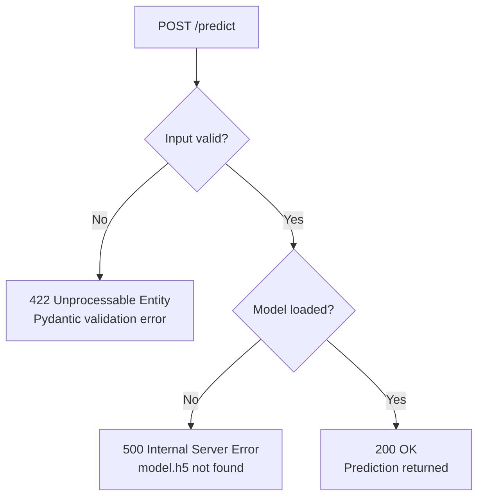

If the model file was not generated (i.e., `python model.py` was not run before starting the backend), the backend will fail to start with a file not found error. If the input data has the wrong type or shape, FastAPI returns a validation error. These are the two most common failure points in this project.

</details>

---

<details>
<summary>12 - `requirements.txt` File</summary>

<br/>

```text
tensorflow
fastapi
uvicorn
pydantic
streamlit
requests
```

<details>
<summary><strong>Why each dependency is needed</strong></summary>

## `tensorflow`

Used to create, train, save, and load the neural network.

## `fastapi`

Used to build the backend API.

## `uvicorn`

Used to run the FastAPI application server.

## `pydantic`

Used by FastAPI for request validation.

## `streamlit`

Used to create the frontend interface.

## `requests`

Used by Streamlit to communicate with the backend API.

</details>

</details>

---

<details>
<summary>13 - Installation Steps</summary>

<br/>

## 13.1 - Clone the repository

```bash
git clone https://github.com/hrhouma/fastapi-calculator-tensorflow-1.git
cd fastapi-calculator-tensorflow-1
```

## 13.2 - Create and activate a virtual environment

```bash
python -m venv myenv
```

### On Windows

```bash
myenv\Scripts\activate
```

### On macOS and Linux

```bash
source myenv/bin/activate
```

## 13.3 - Install dependencies

```bash
pip install -r requirements.txt
```

## 13.4 - Train the model

```bash
python model.py
```

## 13.5 - Start the backend

```bash
uvicorn backend:app --reload
```

## 13.6 - Start the frontend

```bash
streamlit run frontend.py
```

</details>

---

<details>
<summary>14 - Execution Order</summary>

<br/>

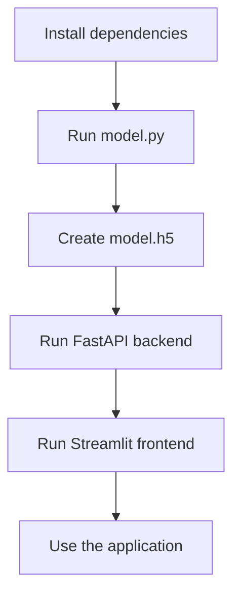

<details>
<summary><strong>Why this order matters</strong></summary>

You must first run:

```bash
python model.py
```

because this creates the file:

```text
model.h5
```

Without this file, the backend cannot load the trained model and will fail at startup.

</details>

</details>

---

<details>
<summary>15 - Example JSON Input and Output</summary>

<br/>

JSON (JavaScript Object Notation) is the communication language between the frontend and the backend in this project. Every prediction starts with a JSON request sent by Streamlit and ends with a JSON response returned by FastAPI. Understanding this exchange is key to understanding how the two components are connected.

## Request

The frontend sends the 8 feature values as a JSON array inside a key called `features`:

```json
{
  "features": [0.5, 0.8, 0.1, 0.6, 0.9, 0.4, 0.3, 0.7]
}
```

This structure is defined by the `PredictionInput` Pydantic class in `backend.py`. If the JSON does not contain the `features` key, or if the value is not a list, FastAPI automatically returns a 422 validation error.

## Response

The backend processes the input and returns the prediction as a float:

```json
{
  "prediction": 0.9123457670211792
}
```

The sum of the 8 input values above is:
```text
0.5 + 0.8 + 0.1 + 0.6 + 0.9 + 0.4 + 0.3 + 0.7 = 4.3
```

Since 4.3 > 4, the true label for this sample is 1. The model correctly predicted a high probability close to 1, which shows it has learned the classification rule.

## More examples

| Features (sum) | Sum | True label | Predicted prob. | Correct? |
|---|---|---|---|---|
| [0.1, 0.1, 0.2, 0.1, 0.3, 0.1, 0.2, 0.1] | 1.2 | 0 | ≈ 0.04 | Yes |
| [0.5, 0.5, 0.5, 0.5, 0.5, 0.5, 0.5, 0.5] | 4.0 | 0 | ≈ 0.48 | Uncertain |
| [0.9, 0.8, 0.7, 0.9, 0.8, 0.7, 0.9, 0.8] | 6.5 | 1 | ≈ 0.97 | Yes |

The middle row (sum = 4.0 exactly) is at the decision boundary. The model is expected to be uncertain there, and a prediction near 0.5 is reasonable.

<details>
<summary><strong>How to interpret the prediction</strong></summary>

The output is a probability between 0 and 1.

It is produced by the sigmoid activation function in the output layer, which compresses any real number into the range (0, 1).

For example:

* `0.10` means the model is leaning toward class 0 with high confidence
* `0.48` means the model is uncertain — the sample is near the decision boundary
* `0.90` means the model is leaning toward class 1 with high confidence

A common threshold is:

* prediction >= 0.5 → class 1
* prediction < 0.5 → class 0

In the frontend, this threshold is not explicitly applied — the raw probability is displayed. In a production system, you would typically apply the threshold and display a human-readable label such as "High risk" or "Low risk" instead of a raw number.

</details>

</details>

---

<details>
<summary>16 - Important Notes</summary>

<br/>

<details>
<summary><strong>Important technical remarks</strong></summary>

## Dummy dataset

This project uses an artificial dataset created with random values.
It is meant for learning and demonstration only.

## Local execution

The backend URL is:

```text
http://127.0.0.1:8000
```

This means the frontend and backend are expected to run on the same local machine.

## Saved model formats and deployment options

This project saves the model as `model.h5`, but this is only one of several available formats. Each format has its own purpose depending on the deployment target.

---

### Format 1 — `.h5` (HDF5)

```python
model.save('model.h5')
model = tf.keras.models.load_model('model.h5')
```

* classic Keras format
* stores the architecture, weights, and training configuration in a single file
* easy to use and widely supported
* **limitation**: being deprecated in newer versions of Keras

---

### Format 2 — SavedModel (TensorFlow native)

```python
model.save('my_model')
model = tf.keras.models.load_model('my_model')
```

* the recommended format for TensorFlow 2.x
* saves the model as a folder containing the graph and the weights
* compatible with TensorFlow Serving and TensorFlow Lite conversion
* **recommended for production**

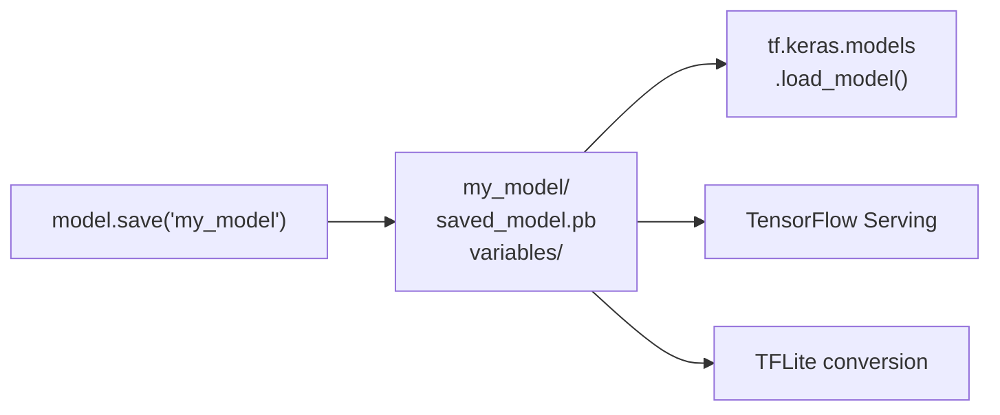

---

### Format 3 — `.keras` (Keras v3)

```python
model.save('model.keras')
model = tf.keras.models.load_model('model.keras')
```

* new native format introduced in Keras 3
* replaces `.h5` as the default single-file format
* more robust and better supported going forward

---

### Format 4 — TFLite (mobile and edge devices)

```python
converter = tf.lite.TFLiteConverter.from_saved_model('my_model')
tflite_model = converter.convert()
with open('model.tflite', 'wb') as f:
    f.write(tflite_model)
```

* optimized for deployment on mobile phones, Raspberry Pi, microcontrollers
* much smaller file size
* faster inference with lower memory usage

```mermaid
flowchart LR
    A["SavedModel"] --> B["TFLiteConverter"]
    B --> C["model.tflite"]
    C --> D["Android / iOS"]
    C --> E["Raspberry Pi"]
    C --> F["Microcontroller"]
```

---

### Format 5 — ONNX (cross-framework)

```python
import tf2onnx
import onnx
model_proto, _ = tf2onnx.convert.from_keras(model)
onnx.save(model_proto, 'model.onnx')
```

* open standard format supported by many frameworks
* allows exporting a TensorFlow model and running it with PyTorch, scikit-learn runtime, or other tools
* useful for interoperability between teams using different frameworks

```mermaid
flowchart LR
    A["TensorFlow model"] --> B["tf2onnx"]
    B --> C["model.onnx"]
    C --> D["ONNX Runtime"]
    C --> E["PyTorch inference"]
    C --> F["Azure ML / AWS SageMaker"]
```

---

### Deployment comparison

| Format | Use case | File type |
|---|---|---|
| `.h5` | learning / legacy projects | single file |
| `SavedModel` | production / TF Serving | folder |
| `.keras` | modern Keras projects | single file |
| `.tflite` | mobile and edge devices | single file |
| `.onnx` | cross-framework deployment | single file |

## No preprocessing validation

This project is intentionally simple.
In a production system, you would usually add:

* stricter input validation,
* error handling,
* logging,
* model versioning,
* security controls,
* preprocessing steps.

</details>

</details>

---

<details>
<summary>17 - Commands Summary</summary>

<br/>

```bash
# Clone the repository
git clone https://github.com/hrhouma/fastapi-calculator-tensorflow-1.git
cd fastapi-calculator-tensorflow-1

# Create and activate a virtual environment
python -m venv myenv

# On Windows
myenv\Scripts\activate

# On macOS and Linux
source myenv/bin/activate

# Install dependencies
pip install -r requirements.txt

# Train and save the model
python model.py

# Start the FastAPI server
uvicorn backend:app --reload

# Run the Streamlit application
streamlit run frontend.py
```

</details>

---

<details>
<summary>18 - Possible Improvements</summary>

<br/>

<details>
<summary><strong>Ideas to improve the project</strong></summary>

You can improve this project by adding:

* real dataset loading from CSV,
* better input validation,
* a threshold-based class label,
* Docker support,
* a `/health` endpoint,
* a model evaluation report,
* charts in Streamlit,
* confidence display,
* error handling for invalid inputs,
* multi-class classification,
* database logging of predictions.

</details>

</details>

---

<details>
<summary>19 - Conclusion</summary>

<br/>

This project is a complete introduction to building an AI-powered application from scratch. It covers the full lifecycle of a machine learning model: from data generation and training, to serving predictions through an API, to displaying results in a user interface.

The three technologies used — TensorFlow, FastAPI, and Streamlit — each solve a distinct problem:

* **TensorFlow** handles the mathematical complexity of training a neural network. It manages the forward pass, the loss computation, the backpropagation, and the weight updates. Without it, building a neural network from scratch would require implementing hundreds of mathematical operations manually.

* **FastAPI** solves the problem of making the model accessible over a network. Once the model is saved to disk, FastAPI loads it and exposes it through an HTTP endpoint. Any client — a web app, a mobile app, a script — can then query the model by sending a POST request.

* **Streamlit** provides a way to build a usable interface without writing any HTML, CSS, or JavaScript. It allows Python developers to create interactive forms and display results using only Python code.

Together, these three components form a pattern that appears in many real-world AI systems. The model is trained offline, packaged inside a service, and consumed by a client application. This is the foundation of what is often called **model serving** or **ML deployment**.

```mermaid
flowchart TD
    subgraph TRAIN["Offline — Training phase"]
        D["Raw data"] --> T["TensorFlow training"]
        T --> S["Saved model\nmodel.h5 / SavedModel"]
    end

    subgraph SERVE["Online — Serving phase"]
        S --> B["FastAPI\nloads model at startup"]
        B --> E["/predict endpoint\naccepts POST requests"]
    end

    subgraph USE["User interaction"]
        E --> F["Streamlit\ncollects input"]
        F -->|"HTTP POST"| E
        F --> U["User sees\nthe prediction"]
    end
```

### What to explore next

This project opens the door to many more advanced topics:

* **Preprocessing pipelines** — In real projects, raw data must be cleaned, normalized, and encoded before feeding it to a model. Libraries like `scikit-learn` provide robust tools for this.

* **Model evaluation** — Beyond accuracy, metrics like precision, recall, F1-score, and ROC-AUC give a more complete picture of model performance. A confusion matrix helps visualize where the model makes mistakes.

* **Experiment tracking** — Tools like MLflow or Weights & Biases allow teams to record hyperparameters, metrics, and model versions across multiple training runs.

* **Containerization** — Packaging the backend in a Docker container makes it portable and deployable to any cloud provider with a single command.

* **Cloud deployment** — The FastAPI backend can be deployed to AWS, Google Cloud, or Azure, making the model accessible globally rather than only on a local machine.

* **Asynchronous APIs** — FastAPI supports async endpoints, which allows the backend to handle many simultaneous prediction requests efficiently.

* **Model monitoring** — In production, models can degrade over time as real-world data drifts away from training data. Monitoring tools detect this drift and trigger retraining when needed.

Each of these topics builds directly on the foundation demonstrated in this project. The architecture of train → save → serve → display is the starting point for all of them.

</details>
